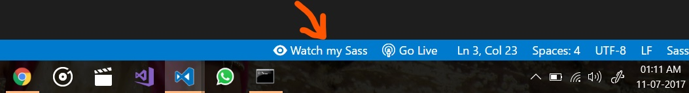

_[I'm sorry but I'm now super busy, If you want to be a maintainer of the project please feel me to contact me! You've to be passionate about programming]_

# Live Sass Compiler

**_[If you like the extension, [please leave a review](https://marketplace.visualstudio.com/items?itemName=ritwickdey.live-sass#review-details), it puts a smile on my face.]_**

**_[If you found any bug or if you have any suggestion, feel free to report or suggest me.]_**

   

A VSCode Extension that help you to compile/transpile your SASS/SCSS files to CSS files at realtime with live browser reload.

## Usage/Shortcuts
1. Click to `Watch Sass` from Statusbar to turn on the live compilation and then click to `Stop Watching Sass` from Statusbar to turn on live compilation . 

2. Press `F1` or `ctrl+shift+P` and type `Live Sass: Watch Sass` to start live compilation or, type `Live Sass: Stop Watching Sass` to stop a live compilation.
3. Press `F1` or `ctrl+shift+P` and type `Live Sass: Compile Sass - Without Watch Mode ` to compile Sass or Scss for one time.

## Features
* Live SASS & SCSS Compile.
* Customizable file location of exported CSS.
* Customizable exported CSS Style (`expanded`, `compact`, `compressed`, `nested`).
* Customizable extension name (`.css` or `.min.css`).
* Quick Status bar control.
* Exclude Specific Folders by settings. 
* Live Reload to browser (Dependency on `Live Server` extension).
* Autoprefix Supported (See setting section)

## Installation
Open VSCode Editor and Press `ctrl+P`, type `ext install live-sass`.

## Settings
All settings are now listed here  [Settings Docs](./docs/settings.md).

## FAQ
*All FAQs are now listed here [FAQ Docs](./docs/faqs.md)*

## Extension Dependency 
This extension has dependency on _[Live Server](https://marketplace.visualstudio.com/items?itemName=ritwickdey.LiveServer)_ extension for live browser reload.

## What's new ?

* #### Version 3.0.0 (11.07.2018)
    *  Upgrade `sass.js` library that included fixes for 8 digit Hex code & grid name. [Fixes [#39](https://github.com/ritwickdey/vscode-live-sass-compiler/issues/39), [#40](https://github.com/ritwickdey/vscode-live-sass-compiler/issues/40), [#78](https://github.com/ritwickdey/vscode-live-sass-compiler/issues/77)]  

## Changelog
To check full changelog click here [changelog](CHANGELOG.md).

## LICENSE
This extension is licensed under the [MIT License](LICENSE)
