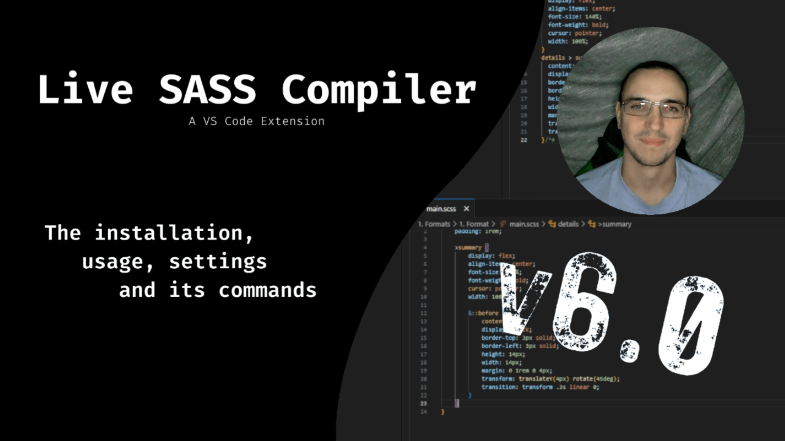

# Live Sass Compiler

   

_**Like it?** [Leave a review](https://marketplace.visualstudio.com/items?itemName=glenn2223.live-sass#review-details) (please)  
**Something wrong?** [Report an issue](https://github.com/glenn2223/vscode-live-sass-compiler/issues/new)  
**New hear?** Watch the [YouTube video](https://youtu.be/6Wo3mYBLNyA)_

A VSCode Extension that help you to compile/transpile your SASS/SCSS files to CSS at real-time.

### Project links

-   [Installation](#installation)
-   [Settings & Commands Docs](./docs/settings.md)
-   [FAQs](./docs/faqs.md)
-   [Changelog](CHANGELOG.md)
-   [License (MIT)](LICENSE)
-   [Open Source Commitment](#our-open-source-commitment)

## Features

-   Live SASS & SCSS compile.
-   Customizable file location of exported CSS.
-   Customizable exported CSS style (`expanded`, `compressed`).
-   Customizable extension name (`.css` or `.min.css`).
-   Quick status bar control.
-   Exclude specific folders by settings.
-   Autoprefix support (See [settings section](./docs/settings.md#livesasscompilesettingsautoprefix))
-   Reference a node module with a leading tilde e.g `~/nodePackage/theSass.scss`

## Usage/Shortcuts

1. Click to `Watch Sass` from the status bar to turn on the live compilation and then click to `Stop Watching Sass` from the status bar to turn off live compilation.  
   

2. Press `F1` or `ctrl+shift+P` and enter `Live Sass: Watch Sass` to start watching and `Live Sass: Stop Watching Sass` to stop watching.
3. Press `F1` or `ctrl+shift+P` and enter `Live Sass: Compile Sass - Without Watch Mode ` to compile one time compile the current file.

### Under the hood details

This extension is actually quite simple in it's implementation. Partial files compile all files in your project and non-partials compile just themselves. By default partial files are those that start with an underscore "`_`" however, you can specify a location/glob pattern by changing the `liveSassCompile.settings.partialsList` setting (which defaults to `["/**/_*.s[ac]ss"]`)

## Installation

Open VSCode Editor and Press `ctrl+P`, type `ext install glenn2223.live-sass`.

## Our Open Source Commitment

The open source community is struggling! Open source maintainers spends countless unpaid hours supporting those using their project, they need some support back! This is why we have an Open Source Commitment.

Any monthly donations that we get - specifically referencing this project - will be shared with our dependencies (specified below). We support the packages that need it most, so we may not donate to all dependencies (often those developed/maintained by big enterprises). We can also only support the ones have a means of receiving donations.

**Who should donate to this project?**

-   Those who use this product and receive some kind of profit as a result. Why not allocate a small margin to those supporting your project? This would mean the world to them.
-   Those with a little extra money that they wouldn't mind using to support the open source community

**Who do you share with?**

-   [`fdir`](https://github.com/thecodrr/fdir)
-   [`picomatch`](https://github.com/micromatch/picomatch)

**How much do you share?** (% are rounded to nearest £)

-   Donations < £20/m => £0
-   Donations > £20/m
    -   `fdir` => 10%
    -   `picomatch` => 10%
-   Donations > £100/m
    -   `fdir` => 25%
    -   `picomatch` => 25%

**_We hope that the project(s) we're supporting also have their own open source commitment, supporting the projects that make their solution work._**

## Thank you Ritwick Dey

A big thank you to [@ritwickdey](https://github.com/ritwickdey) for all his work. However, as they are no longer maintaining the [original work](https://github.com/ritwickdey/vscode-live-sass-compiler), I have released my own which has built upon it.
